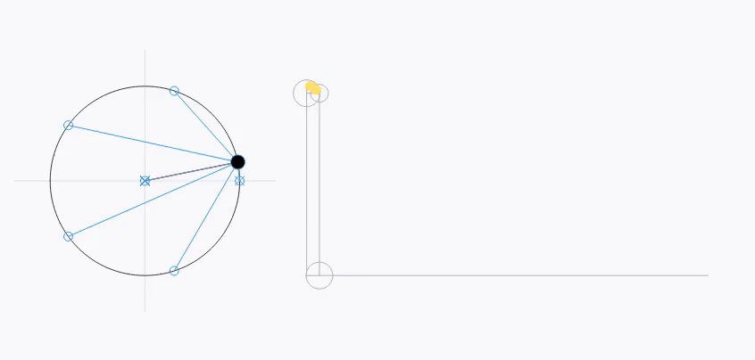
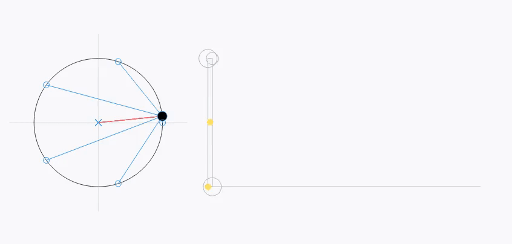

# z-transform-visualization
Visualizing the magnitude response of the z-transform of a system with a geometric interpretation.

## CIC / MAV

## Comb

## Lowpass

## Madness

## Explanation
The z-transform of a difference equation of a system, e.g. an FIR-Filter, is defined by

which can be rewritten in terms of the system's poles and zeroes:

When looking for the magnitude response, one should then look at the z-transform on the unit circle only, i.e. at  where  is the normalized frequency.

You can see, that the products are simply the products of the distances of a point running on the unit circle to all the poles or zeros (complex numbers) respectively. So for any angle :

1. Calculate the distances from the point on the unit circle to all 
   * Zeroes --> Numerator
   * Poles  --> Denominator
2. Multiply all the distances, respectively
3. Divide numerator by denominator
4. Plot result at the angle 
5. Profit

The code is kinda terrible and needs a lot of refactoring, but it serves the purpose :)
